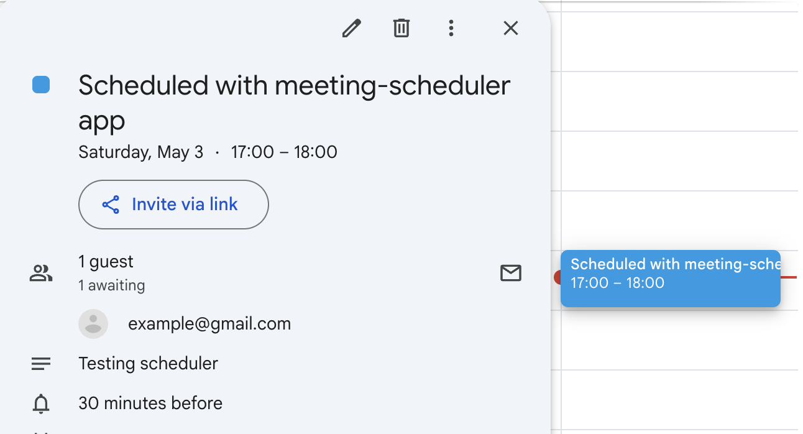
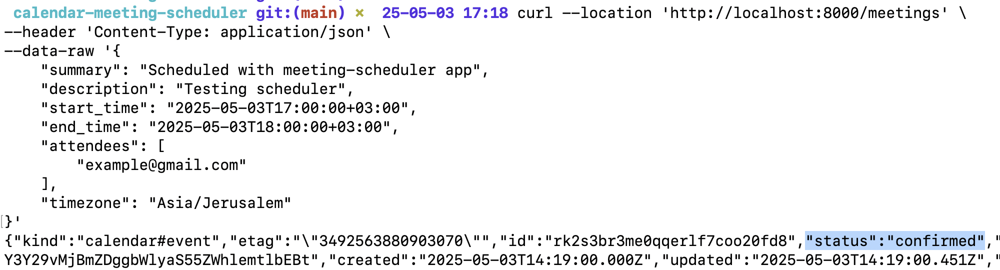

# Google Calendar Meeting Scheduler

A Python backend service that allows users to create meetings in their Google Calendar through an HTTP API.





## Prerequisites

- Python 3.11+
- Docker and Docker Compose
- Google Calendar API OAuth 2.0 credentials (credentials.json)

## Setup

1. Clone the repository
2. Set up Google Calendar API:
   - Go to the [Google Cloud Console](https://console.cloud.google.com/)
   - Create a new project or select an existing one
   - Enable the Google Calendar API
   - Create OAuth 2.0 credentials:
     - Go to "APIs & Services" > "Credentials"
     - Click "Create Credentials" > "OAuth client ID"
     - Choose "Desktop app" as the application type
     - Name it "Calendar Meeting Scheduler"
     - Download the credentials and save them as `credentials.json` in the project root

## Running with Docker

1. First-time setup:
   ```bash
   docker-compose up --build
   ```
   - The application will print an authorization URL
   - Copy the URL and open it in your browser
   - Sign in with your Google account
   - Grant the requested permissions
   - Copy the authorization code
   - Set it as an environment variable:
     ```bash
     export AUTH_CODE="your_authorization_code"
     ```

2. Run the application:
   ```bash
   docker-compose up
   ```

3. The API will be available at `http://localhost:8000`

## Running Locally

1. Create a virtual environment:
   ```bash
   python -m venv venv
   source venv/bin/activate  # On Windows: venv\Scripts\activate
   ```

2. Install dependencies:
   ```bash
   pip install -r requirements.txt
   ```

3. Run the application:
   ```bash
   uvicorn src.app.main:app --reload
   ```

4. For local testing of calendar functionality:
   ```bash
   python run_local.py
   ```

## API Endpoints

### Create Meeting
`POST /meetings`

Creates a new meeting in the Google Calendar:


```shell
curl --location 'http://localhost:8000/meetings' \
--header 'Content-Type: application/json' \
--data-raw '{
    "summary": "Scheduled with meeting-scheduler app",    
    "description": "Testing scheduler",
    "start_time": "2025-05-03T17:00:00+03:00",
    "end_time": "2025-05-03T18:00:00+03:00",
    "attendees": [
        "example@gmail.com"
    ],
    "timezone": "Asia/Jerusalem"
}'
```


Example:




### Health Check
`GET /health`

Returns the health status of the service.

Response:
```json
{
  "status": "healthy"
}
```

## Running Tests

```bash
pytest tests/
```

## Development

The project structure:
```
.
├── src/
│   └── app/
│       ├── main.py          # FastAPI application
│       ├── models.py        # Pydantic models
│       ├── calendar_service.py  # Google Calendar integration
│       └── config.py        # Configuration settings
├── tests/
│   └── test_main.py        # API endpoint tests
├── run_local.py            # Local testing script
├── requirements.txt        # Python dependencies
├── Dockerfile             # Container configuration
└── docker-compose.yml     # Docker services configuration
``` 